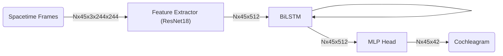

# BiLSTM Model

This directory holds the modified implementation of the model architecture described by the original paper, by replacing standard LSTMs with Bidirectional LSTMs.

### Model Architecture

