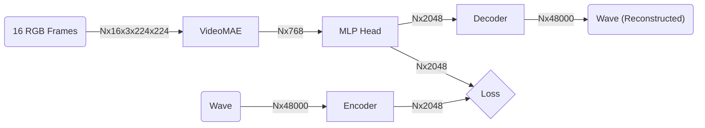

# Latent VideoMAE Model

This directory holds the implementation for the Audio AutoEncoder, and the modified VideoMAE model that works with the latent space representation of the waveform.

The AutoEncoder uses 1D convolutions and deconvolutions instead of fully connected layers. This allows it to focus on temporally localized data as well as makes the model have a significantly smaller memory footprint.

We train the VideoMAE model on the latent space representations of the waves instead of on cochleagrams:

