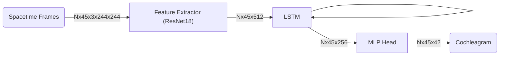

# Paper Model

This directory holds the implementation of the model architecture described by the original paper.

### Model Architecture

### Experiments

We initially designed the architecture exactly as described in the paper.

The input to the feature extactor is a set of 45 spacetime frames. Each of the resulting 45 embeddings are then concatenated with the features of the first color frame, resulting in an $N\times 45\times 1024$ tensor being fed into the LSTM. Such an operation requires writing inefficient loops in the forward pass, and we found that it didn't improve the performance at all, and so we simplified the model by only taking as input the spacetime frames, leaving out the color information.

We also trained the model with the loss described in the paper (`VISLoss`):

$$
E(\{\vec s_t\}) = \sum_{t=1}^T \rho(\lvert \vec s_t - \tilde{\vec s_t} \rvert_2)
$$

Where $\rho = \log(\epsilon + r^2)$. We found that MSE actually performs better, so our final model was trained with MSE loss instead.