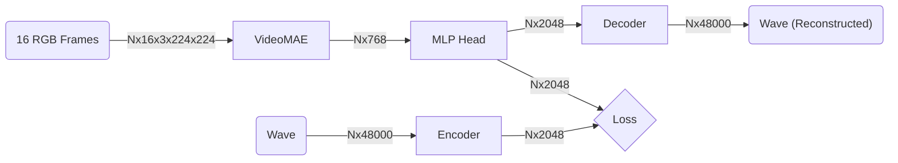

# VideoMAE Model

This directory holds the implementation of `VISVMAEModel`, an entirely new approach to the model architecture for this problem. We replace the ResNet18 feature extractor + LSTM layer from the original implemenation with a pretrained Video Masked AutoEncoder. This takes as input a stack of 16 RGB frames and returns a single 768 dimension embedding. This embedding is fed into an MLP head who's output is an 1840 vector, which is then reshaped into a 45x42 tensor and compared against the corresponding cochleagram.

